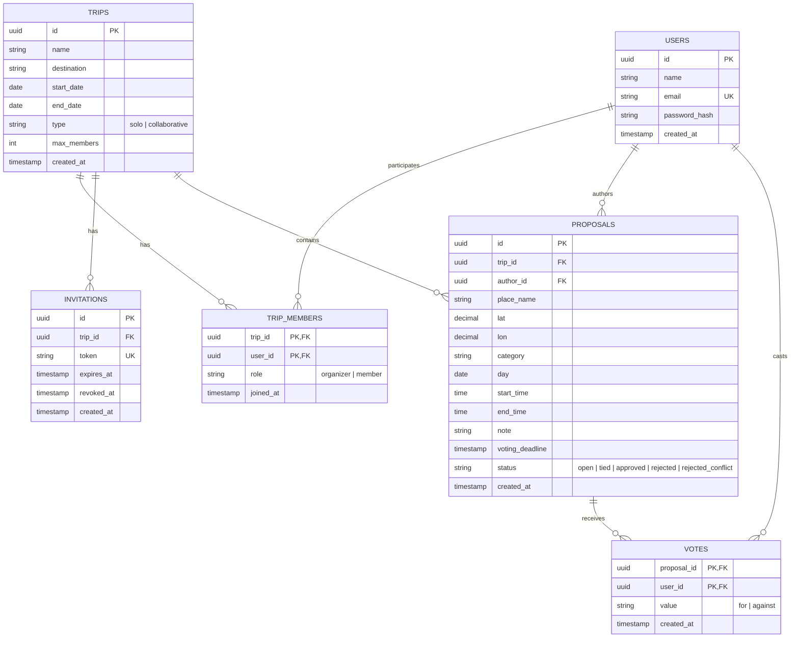

# MapMates: Data Model

## 1. Entity-relationship diagram

```mermaid
erDiagram
    USERS ||--o{ TRIP_MEMBERS : "participates"
    TRIPS ||--o{ TRIP_MEMBERS : "has"
    TRIPS ||--o{ INVITATIONS : "has"
    TRIPS ||--o{ PROPOSALS : "contains"
    USERS ||--o{ PROPOSALS : "authors"
    PROPOSALS ||--o{ VOTES : "receives"
    USERS ||--o{ VOTES : "casts"

    USERS {
        uuid id PK
        string name
        string email UK
        string password_hash
        timestamp created_at
    }
    TRIPS {
        uuid id PK
        string name
        string destination
        date start_date
        date end_date
        string type "solo | collaborative"
        int max_members
        timestamp created_at
    }
    TRIP_MEMBERS {
        uuid trip_id PK, FK
        uuid user_id PK, FK
        string role "organizer | member"
        timestamp joined_at
    }
    INVITATIONS {
        uuid id PK
        uuid trip_id FK
        string token UK
        timestamp expires_at
        timestamp revoked_at
        timestamp created_at
    }
    PROPOSALS {
        uuid id PK
        uuid trip_id FK
        uuid author_id FK
        string place_name
        decimal lat
        decimal lon
        string category
        date day
        time start_time
        time end_time
        string note
        timestamp voting_deadline
        string status "open | tied | approved | rejected | rejected_conflict"
        timestamp created_at
    }
    VOTES {
        uuid proposal_id PK, FK
        uuid user_id PK, FK
        string value "for | against"
        timestamp created_at
    }
```